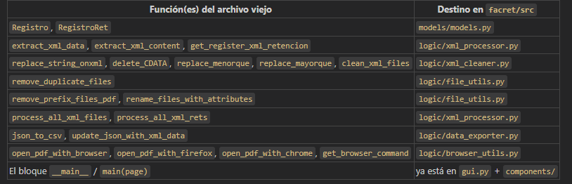

# FACRET — Automatización y Revisión de XML Financieros

Herramienta de escritorio desarrollada en Python con [Flet](https://flet.dev/), orientada a automatizar la revisión y procesamiento de archivos XML de facturas y retenciones para el área financiera de **EMOV EP**.

---

## Qué hace

- Explora carpetas y lista archivos XML, PDF y otros documentos financieros.
- Previsualiza archivos de texto y PDF (primera página como imagen).
- Búsqueda avanzada con resaltado de coincidencias en contenido y nombre de archivo.
- Procesa y valida XML de facturas y retenciones: extracción de datos, detección de duplicados y renombrado.
- Descarga facturas ETAPA directamente desde Outlook local (sin cuenta Microsoft paga).
- Interfaz moderna estilo explorador de archivos con header responsivo, sidebar de navegación y barra de estado.

---

## Stack tecnológico

| Componente              | Tecnología                       |
| ----------------------- | --------------------------------- |
| Lenguaje                | Python >= 3.11                    |
| UI Framework            | [Flet](https://flet.dev/) 0.28.3     |
| Renderizado PDF         | pdf2image + Poppler 24.08.0       |
| Automatización Outlook | pywin32 (win32com)                |
| Gestión de proyecto    | [Poetry](https://python-poetry.org/) |

---

## Requisitos previos

- Python 3.11 o superior
- [Poetry](https://python-poetry.org/docs/#installation) instalado
- Poppler incluido en `src/poppler-24.08.0/` para Windows
- Microsoft Outlook instalado y configurado (para la funcionalidad Download FACS)

---

## Instalación

```bash
# Clonar el repositorio
git clone <url-del-repo>
cd prj-python/facret

# Instalar dependencias con Poetry
poetry install

# Ejecutar la aplicación
poetry run python src/main_drive.py
```

---

## Estructura del proyecto

```
facret/
├── pyproject.toml              # Configuración Poetry
├── poetry.lock                 # Dependencias resueltas
├── README.md
│
├── src/                        # Código fuente
│   ├── main_drive.py           # Punto de entrada
│   ├── drive_gui.py            # Orquestador principal de la UI
│   │
│   ├── components/             # Componentes UI
│   │   ├── header/             # Encabezado superior responsivo
│   │   │   ├── responsive_header.py   # Orquestador del header
│   │   │   ├── app_brand.py           # Logo y nombre de la app
│   │   │   ├── search_component.py    # Búsqueda con filtros
│   │   │   ├── tools_component.py     # Botones de acción
│   │   │   └── user_session.py        # Sesión y perfil de usuario
│   │   ├── drive_toolbar.py    # Barra secundaria: hamburguesa + breadcrumb
│   │   ├── drive_sidebar.py    # Menú lateral de navegación (colapsable)
│   │   ├── drive_content.py    # Área principal de contenido
│   │   └── facs_downloader_panel.py  # Panel de descarga de facturas ETAPA
│   │
│   ├── config/
│   │   └── drive_theme.py      # Tema global: colores, tipografía, estilos
│   │
│   ├── logic/
│   │   └── facs_downloader.py  # Lógica de descarga desde Outlook
│   │
│   └── assets/                 # Recursos estáticos
│       ├── favicon.ico
│       └── favicon.png
│
├── data/                       # Datos y plantillas
│   ├── exports/                # Archivos generados (logs, reportes)
│   ├── samples/                # Documentos de ejemplo para pruebas
│   └── templates/              # Plantillas de reportes y XML
│
└── _legacy/                    # Versiones anteriores de la interfaz (no activas)
```

---

## Arquitectura

El flujo de ejecución sigue un patrón orquestador → componentes:

```
main_drive.py
    └── drive_gui.py  (orquestador)
            ├── config/drive_theme.py              ← tema global
            ├── components/header/
            │   └── responsive_header.py           ← header con 4 subcomponentes
            ├── components/drive_toolbar.py        ← hamburguesa + breadcrumb
            ├── components/drive_sidebar.py        ← navegación lateral (colapsable)
            ├── components/drive_content.py        ← contenido principal
            └── components/facs_downloader_panel.py ← descarga facturas ETAPA
```

---

## Funcionalidades implementadas

- Interfaz de explorador de archivos completamente funcional con diseño responsivo.
- Header modular dividido en 4 subcomponentes independientes (brand, search, tools, session).
- Barra secundaria (`drive_toolbar.py`) con botón hamburguesa y breadcrumb de navegación.
- Sidebar colapsable: el botón hamburguesa alterna el sidebar entre 280px y oculto.
- Breadcrumb reactivo: actualiza automáticamente el nombre de la sección activa al navegar.
- Área de contenido con listado, previsualización y operaciones sobre archivos.
- Panel de descarga FACS: conecta a Outlook local vía win32com y descarga adjuntos XML/PDF de facturas ETAPA sin requerir cuenta Microsoft paga.
- Tema centralizado (`drive_theme.py`) que controla toda la paleta visual.

---


Mapeo del código monolítico → estructura del proyecto
El archivo que me pasaste tiene funciones que encajan así:


Pasos para migrar
Paso 1 — models/models.py (lo más simple, sin dependencias)

Mover Registro y RegistroRet
Paso 2 — logic/xml_cleaner.py (solo usa stdlib: os, re)

Mover las funciones de limpieza de XML (clean_xml_files y sus helpers)
Paso 3 — logic/xml_processor.py (depende de models + xml_cleaner)

Mover extract_xml_data, extract_xml_content, get_register_xml_retencion, process_all_xml_files, process_all_xml_rets
Paso 4 — logic/file_utils.py (solo usa stdlib)

Mover remove_duplicate_files, remove_prefix_files_pdf, rename_files_with_attributes
Paso 5 — logic/data_exporter.py (depende de xml_processor)

Mover json_to_csv, update_json_with_xml_data
Paso 6 — logic/browser_utils.py (solo usa stdlib)

Mover open_pdf_with_*, get_browser_command
Paso 7 — conectar al menú en components/

Crear components/file_tools_menu.py con el PopupMenuButton que llama a la lógica nueva

## Licencia

MIT — Carlos Sigua
